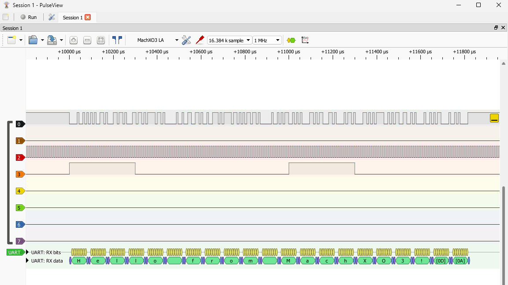
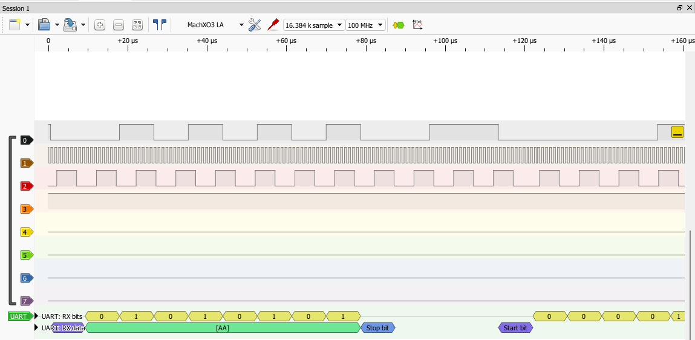
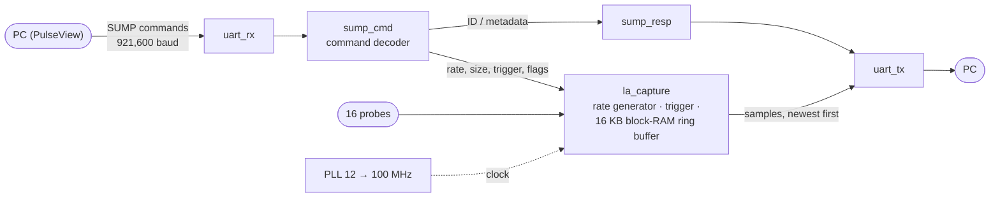

# MachXO3 Logic Analyzer

[](../../actions/workflows/sim.yml)

A **16-channel, 100 MHz logic analyzer** built from scratch in Verilog on a Lattice MachXO3 FPGA. It speaks the SUMP / Openbench Logic Sniffer protocol over USB serial, so **PulseView (sigrok)** works as the front end out of the box, protocol decoders included.




| | |
|---|---|
| **Channels** | 16 (or 8 for double the depth) |
| **Sample rate** | up to **100 MHz**, every rate exact (100 MHz / *n*) |
| **Depth** | 8,192 samples × 16 ch · 16,384 samples × 8 ch (block RAM) |
| **Trigger** | pattern on any channels (high/low), with pre-trigger capture |
| **Front end** | PulseView / sigrok-cli, or the included Python client (`host/sump.py`) |
| **Device** | LCMXO3L-6900C on the MachXO3 Starter Kit; ~17 % of logic, 16 of 26 block RAMs |
| **Timing** | closes at **100 MHz** after five rounds of timing work ([notes](docs/ENGINEERING_NOTES.md#timing-closure-at-100-mhz)) |
| **Verification** | 21 self-checking simulation tests + mutation testing, run in CI on every push |

## Architecture



1. **Configure.** PulseView sends sample rate, sample count, pre-trigger ratio, enabled channel groups and trigger pattern as 5-byte SUMP commands.
2. **Arm.** Samples stream into a ring buffer in block RAM. Once enough pre-trigger samples are stored, every sample is checked against the trigger.
3. **Trigger.** Capture continues for the requested number of post-trigger samples.
4. **Read out.** Samples go back to the PC newest-first, as the protocol requires, using one byte per enabled 8-channel group.

Design details (rate generator, memory layout, protocol subset): [docs/ENGINEERING_NOTES.md](docs/ENGINEERING_NOTES.md).

## Engineering highlights

- **Protocol compatibility from the source.** The SUMP implementation was matched against sigrok's OLS driver source: command bytes, sample order, metadata tokens, and how sigrok divides memory between channel groups. The result is an unmodified PulseView install that recognizes the board as "MachXO3 LA with 16 channels".
- **Timing closure at 100 MHz.** The first 100 MHz build missed timing on 4,096 paths. Fixing it meant reading Lattice timing reports path by path:
  - pipelining configuration math
  - rewriting magnitude comparisons as subtractions so they use the carry chain instead of 9-level LUT trees
  - turning "sample due?" into a sign bit
  - adding a register after the 4.7 ns block-RAM read

  [Full story →](docs/ENGINEERING_NOTES.md#timing-closure-at-100-mhz)
- **Hardware bugs that simulation couldn't catch.** Lattice's synthesizer (LSE):
  - silently removed a power-on reset;
  - turned an initial-value FSM into an illegal state;
  - compiled a `case`-table ROM into all zeros (the board answered `\0\0\0\0` to its ID query while every simulation passed).

  Each was diagnosed on hardware with purpose-built debug bitstreams and designed out. [Details →](docs/ENGINEERING_NOTES.md#lessons-from-lattice-lse)
- **Exact rates from any clock.** A fractional rate generator produces SUMP's `100 MHz / (divider+1)` rates from any system clock. The same RTL runs straight from the 12 MHz crystal (no PLL) or at 100 MHz.

## Verification

Everything is checked by self-checking testbenches that play the part of sigrok over the UART. The probes are driven with a counter that increments every clock, so the **exact spacing of every captured sample** can be verified.

| Area | What is checked |
|---|---|
| Protocol | `1ALS` ID reply; metadata parsed exactly as sigrok does |
| Sample rate | 1 MHz = exactly 12 clocks/sample (12 MHz build) or 100 (100 MHz build); 100 MHz = every clock; fractional rates exact on average |
| Trigger | 25 % and 50 % pre-trigger land on exactly the right sample; a trigger already true at arm still waits for valid pre-trigger data |
| Memory modes | 16-ch (8K samples), 8-ch (16K), high group only, oversize requests clamped |
| Robustness | RESET aborts a capture waiting on its trigger; every byte has a valid stop bit |
| Test signals | 1 MHz, 100 kHz, and a UART message that decodes as `Hello from MachXO3!` |

**Mutation testing.** Five deliberately injected bugs were all caught:
- readout order reversed
- pre-trigger wait removed
- post-trigger count off by one
- wrong metadata
- channel-group bytes swapped

```
make test        # both testbenches with Icarus Verilog; same as CI
```

## Quick start

1. **Build:** open Lattice Diamond, add `rtl/` (one top: `la_top` for 12 MHz or `la_top_100` + PLL for 100 MHz) and `constraints/la.lpf`, then build and program.
2. **Check:** `python host/sump.py COM7 selftest` captures an internal test pattern and verifies every sample.
3. **Use:** in PulseView, choose the *Openbench Logic Sniffer & SUMP compatibles* driver, the board's COM port, and 921,600 baud.
4. **Demo:** jumper J4 pin 35 → pin 13, trigger on D0 low, then add a UART decoder at 115200 to see `Hello from MachXO3!`.

Step-by-step build, PLL setup, pinout and PulseView guide: **[docs/GUIDE.md](docs/GUIDE.md)**.

## Repository layout

```
rtl/            Verilog: la_top / la_top_100 (tops), la_core, la_capture, sump_cmd,
                sump_resp, test_gen, uart_rx, uart_tx
constraints/    la.lpf -- pins for the MachXO3 Starter Kit (header J4)
sim/            self-checking testbenches + a PLL stand-in for simulation
host/           sump.py -- command-line client (id, info, selftest, capture -> .vcd)
docs/           GUIDE.md (build & use), ENGINEERING_NOTES.md (design & lessons)
```

## Roadmap

- RLE compression for long captures of slow signals
- Edge and multi-stage triggers
- External clock input for synchronous buses
- FT2232H synchronous-FIFO link for streaming

## License

MIT
